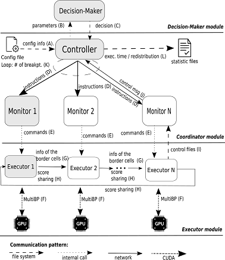

# MultiBP
MultiBP is a framework that allows the comparison of two long DNA sequences using Smith-Waterman algorithm in multiple GPUs with block pruning features using a score-share Static or Dynamic workload distribution.

# Source Code
Static-MultiBP: https://github.com/Marcoacfbr/Static-MultiBP.git

MultiBP framework: https://github.com/Marcoacfbr/MultiBP.git

# SLURM Scripts
The scripts to execute Static-MultiBP and Dynamic-MultiBP in a SLURM environment are availble here: https://github.com/Marcoacfbr/MultiBP-Scripts.git

# Deploy instructions
./configure

make

./makemultibp.sh

# Execution instructions (two GPUs in the local computer)
./balancer 0 &

./balancer 1 &

./controller config.teste

# Diagram

  

# References
Figueiredo, M., Sandes, E., Teodoro, G., & Melo, A. C. (2020, March). Parallel comparison of huge dna sequences in multiple gpus with block pruning. In 2020 28th Euromicro International Conference on Parallel, Distributed and Network-Based Processing (PDP) (pp. 22-29). IEEE.
